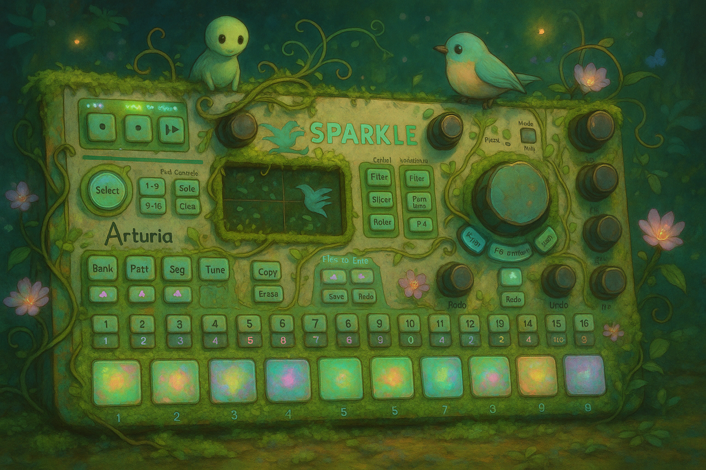

# 🌸 Musical Garden for SparkLE

A toddler-friendly musical playground for the Arturia SparkLE controller featuring nature-themed sounds and educational musical progression.

## 🌸 Overview

The **SparkLE Musical Garden** is an audio-only musical experience designed specifically for 1.8-year-old toddlers. It transforms the Arturia SparkLE MIDI controller into a nature-themed musical playground that teaches cause-effect relationships, patterns, and emotional regulation through interactive sound design.



## ✨ Key Features

- **🌍 Nature-Themed Sounds**: Earth, Rain, Wind, Thunder, Trees, Birds, Insects, and Sun
- **🎵 Layered Sound Architecture**: Background textures + melodic notes that harmonize together
- **👶 Toddler-Safe Audio**: Volume limits, frequency range 200Hz-4kHz, soft envelopes
- **🌱 Progressive Learning**: Four octave ranges (Seeds → Sprouts → Buds → Flowers)
- **🎛️ Environmental Controls**: Temperature, Water, Time of Day, and Seasons via knobs
- **🔄 Toggle Interaction**: Big pads loop ON/OFF, number pads play harmonic notes
- **🖥️ CLI Interface**: Simple command-line operation without GUI dependencies

## 🎮 How It Works

The Musical Garden uses a **layered sound architecture** perfect for toddler exploration:

### Big Pads = Background Textures (Toggle ON/OFF)
Each press toggles the texture between playing (looping) and silent:

- **🌍 Earth**: Deep bass drone for grounding
- **🌧️ Rain**: Rhythmic patter with gentle droplets  
- **💨 Wind**: Whooshing atmospheric texture
- **⛈️ Thunder**: Soft rolling rumble (not scary!)
- **🌳 Trees**: Rustling leaves with creaking wood
- **🐦 Birds**: Ambient chirping atmosphere
- **🐛 Insects**: Gentle buzzing rhythms
- **☀️ Sun**: Warm harmonic drone with overtones

### Number Pads = Melodic Notes (Play over background)
Harmonic notes in pentatonic scale that layer beautifully over any background texture:

- **Row 1 (1-4)**: 🌱 **Seeds** - Bell tones (lower octave)
- **Row 2 (5-8)**: 🌿 **Sprouts** - Soft notes (mid octave)  
- **Row 3 (9-12)**: 🌸 **Buds** - Bright tones (higher octave)
- **Row 4 (13-16)**: 💎 **Flowers** - Sparkle notes (highest octave)

### 🎵 Musical Layering Process
1. **Press big pads** to turn ON atmospheric background textures
2. **Press number pads** to play melodic notes that harmonize over the background
3. **Layer multiple textures** for rich, evolving soundscapes
4. **Add melodies on top** for musical expression and learning

### 🎛️ Environmental Controls
- **K1**: Temperature (brightness/darkness of sounds)
- **K2**: Water (reverb/echo effects)
- **K3**: Time of Day (morning/day/evening moods)
- **Tempo**: Seasons (winter=slow to summer=fast)

## 📦 Installation

### Requirements
- Python 3.7+
- Arturia SparkLE controller (or any MIDI device)

### Setup
```bash
# Install dependencies
pip install -r requirements.txt

# Run the Musical Garden (Simple CLI)
python sparkle_musical_garden.py

# Or run with Garden Monitor Dashboard (TUI)
python sparkle_musical_garden.py --tui
```

## 🚀 Usage

### 🌸 Simple CLI Mode (Default)
1. **Connect your SparkLE** and ensure it's powered on
2. **Run the application**: `python sparkle_musical_garden.py`
3. **Start exploring**: Press big pads for background textures, number pads for melodies
4. **Layer sounds**: Combine multiple background textures and add melodic notes
5. **Use knobs**: Adjust environmental parameters for different moods
6. **Press Ctrl+C**: Put the garden to sleep with a gentle closing ritual

### 📺 Garden Monitor Dashboard (TUI Mode)
For parents who want visual monitoring of their toddler's musical exploration:

```bash
# Run with full-screen garden monitoring dashboard
python sparkle_musical_garden.py --tui
```

**TUI Features:**
- 🌍 **Real-time Garden Status**: See which elements are active (ON/OFF)
- 🎛️ **Environmental Controls**: Live display of Temperature, Water, Time, Season
- 🎵 **Activity Logging**: Track recent melodies and garden interactions  
- ⌨️ **Parent Controls**: `[H]elp` `[R]eset` `[Q]uit` `[M]ute` `[C]lear`
- 🖥️ **Minimal Interface**: Clean curses-based dashboard (no GUI dependencies)

The Musical Garden will:
- 🔍 Auto-detect your SparkLE controller
- 📂 Load button mappings from `setup/sparkle_mapping.json`
- 🎵 Generate nature-themed sounds in real-time
- 👂 Listen for toddler exploration and provide rich audio feedback

## 🗂️ Project Structure

```
midi-sparkle/
├── sparkle_musical_garden.py    # Main Musical Garden application
├── setup/
│   ├── sparkle_mapping.json     # MIDI controller mappings
│   └── setup_mapping.py         # Tool to create/edit MIDI mappings
├── requirements.txt             # Python dependencies
├── STRUCTURE.md                 # Detailed project documentation
├── arturia-sparkle-1280x762.jpg # Controller reference image
└── README.md                    # This file
```

## 🛠️ Configuration

### Setting up MIDI Mappings
```bash
# Create or edit MIDI mappings
python setup/setup_mapping.py
```

The application will automatically load mappings from `setup/sparkle_mapping.json`. If the file is missing, it will use sensible defaults.

## 🎓 Educational Design Philosophy

The Musical Garden follows evidence-based principles for toddler development:

- **🔒 Safety First**: All audio is limited in volume and frequency range
- **🌿 Nature Theme**: Uses natural sounds and concepts rather than synthetic ones
- **📈 Progressive Learning**: Complexity increases naturally as child explores
- **✅ No Failure States**: Everything is "correct" - focus on exploration and joy
- **👨‍👩‍👧‍👦 Parent-Friendly**: Simple monitoring interface and clear audio feedback

## 🧠 Technical Details

- **🎵 Audio Synthesis**: Real-time generation using pygame and numpy
- **🎹 MIDI Processing**: Low-latency note_on/note_off handling with mido
- **⚡ Threading**: Separate threads for MIDI monitoring and status updates
- **🎛️ Pentatonic Scales**: Avoids dissonance for pleasant harmonic layering
- **🛡️ Error Handling**: Graceful degradation if MIDI device unavailable

## 🔧 Troubleshooting

- **❌ No MIDI devices found**: Ensure your SparkLE is connected and powered on
- **🔄 Wrong device connected**: App will use first available MIDI device if SparkLE not detected
- **🔇 No sound**: Check that `pygame` installed correctly and system audio working
- **⚠️ Audio artifacts**: Ensure no other applications are using audio exclusively
- **📺 TUI not displaying**: Ensure terminal is at least 70x20 characters for Garden Monitor Dashboard
- **🖥️ TUI colors missing**: Some terminals don't support colors, but functionality remains unchanged

## 🌟 Future Enhancements

Potential additions based on child development stages:
- **Phase 2 (2-2.5 years)**: Pattern recognition games
- **Phase 3 (2.5-3 years)**: Simple melodies and call-response
- 📹 Recording functionality for capturing musical moments
- 🎨 Additional nature sound variations based on environmental controls

---

Enjoy creating beautiful soundscapes with your little gardener! 🌸🎵👶 